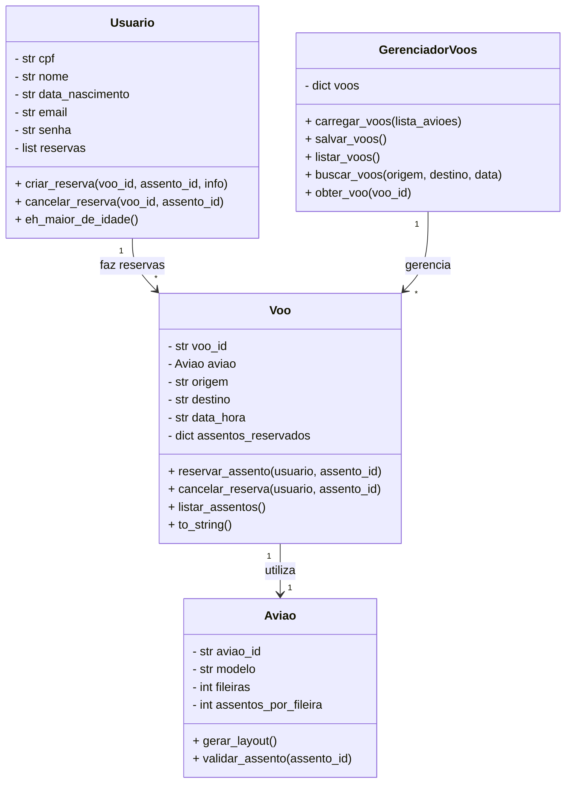

# ✈️ Sistema de Reserva de Voos
AD2 – Programação com Interfaces Gráficas (PIG) – 2025.2

Instituição: Fundação CECIERJ / Consórcio CEDERJ  
Curso: Tecnologia em Sistemas de Computação  
Disciplina: Programação com Interfaces Gráficas (EAD05030)  
_____________

## 📘 Visão Geral

📘 Visão Geral

Este projeto implementa um sistema completo de reservas de assentos em voos comerciais, desenvolvido em Python com orientação a objetos e interface gráfica em Tkinter.

A aplicação permite cadastro e login de usuários, listagem de voos, seleção visual de assentos e confirmação de reservas, com persistência local em arquivos .txt.

O sistema foi desenvolvido em duas etapas:

AD1: Backend funcional com linha de comando (CLI)

AD2: Integração total com interface gráfica (Tkinter)

### 🧮 Diagrama de Classes

    O sistema segue um modelo orientado a objetos, em que cada classe representa um elemento real do domínio (usuário, voo, avião).
    O diagrama abaixo descreve as principais classes e suas relações:


Descrição:

- Usuario gerencia suas próprias reservas e validações de idade.
- Voo mantém o controle dos assentos reservados e a ligação com o avião correspondente.
- Aviao define o layout e as regras dos assentos (incluindo emergências e bloqueios).
- GerenciadorVoos coordena todos os voos existentes e realiza persistência em arquivo.

---

## 💻 Estado Atual (AD2 – Sistema Concluído)

O sistema está 100% funcional e integrado:

- Permite cadastro e autenticação real de usuários
- Exibe voos carregados de arquivo
- Gera o layout de assentos dinamicamente
- Garante as regras de negócio (ex.: menores não podem ocupar assentos de emergência)
- Sincroniza reservas entre o usuário e o voo automaticamente
- Persiste todos os dados em arquivos de texto simples

### 🧭 Estrutura de Telas (Interface Tkinter)

```graphql
App (tk.Tk)
│
├── TelaLogin
│   ├── CPF / Senha
│   └── Botões: Entrar / Cadastrar
│
├── TelaCadastro
│   ├── Campos: CPF, Nome, Data, Email, Senha
│   └── Botões: Salvar / Voltar
│
├── TelaPainel
│   ├── Exibe dados do usuário
│   ├── Botões: Visualizar Voos / Minhas Reservas / Sair
│
├── TelaVoos
│   ├── Lista dinâmica de voos (origem, destino, data, avião)
│   └── Botão: Selecionar
│
└── TelaAssentos
    ├── Layout visual interativo (botões coloridos)
    ├── Cores: verde=livre, vermelho=ocupado, laranja=emergência
    └── Botões: Confirmar Reserva / Voltar
```

## 💺 Funcionalidades Implementadas


| Módulo                 | Funcionalidade                                        | Status |
| ---------------------- | ----------------------------------------------------- | ------ |
| Login / Cadastro       | Autenticação e criação real de usuários               | ✅      |
| Painel do Usuário      | Exibe dados e reservas ativas                         | ✅      |
| Listagem de Voos       | Carregamento dinâmico de `voos.txt`                   | ✅      |
| Seleção de Assentos    | Interface visual e validação de disponibilidade       | ✅      |
| Confirmação de Reserva | Sincronização entre usuário e voo                     | ✅      |
| Persistência           | Atualização automática de `usuarios.txt` e `voos.txt` | ✅      |
| Regras de Negócio      | Restrições por idade e bloqueios de assentos          | ✅      |

---

## 🧱 Estrutura do Projeto
```graphql
sistema_de_reserva_de_voos/
│
├── biblioteca/
│   ├── avioes.py       # Classe Aviao e funções de layout
│   ├── usuarios.py     # Classe Usuario e manipulação de cadastro
│   └── voos.py         # Classe Voo e GerenciadorVoos
│
├── dados/
│   ├── avioes.txt
│   ├── usuarios.txt
│   └── voos.txt
│
├── main.py             # Interface Tkinter (AD2)         
├── teste_backend.py         
├── roteiro_de_testagem.md
└── README.md

```

---

## ⚙️ Como Executar
🔹 Requisitos
- Python 3.8 ou superior
- Nenhuma biblioteca externa (usa apenas o módulo padrão tkinter)
- Compatível com Windows e Linux

### 🔹 Execução Automática (CLI)

- Copie a pasta para o seu diretório local
- Execute teste_backend.py

```bash
python teste_backend.py
```

O arquivo vai mostrar na CLI um conjunto de passos que foram dados para testar as funcionalidades do backend

### 🔹 Execução da Interface Gráfica e Interativa (GUI)

- Na pasta raiz do projeto, execute:

```bash
python main.py
```
- Teste as funcionalidades do Sistema ou siga o roteiro em roteiro_de_testagem.md, contido no projeto

🔹 Fluxo de Uso

1. Cadastre um novo usuário
2. Faça login
3. Escolha um voo disponível
4. Selecione um assento livre
5. Confirme a reserva

    Os arquivos usuarios.txt e voos.txt serão atualizados automaticamente.

## 💾 Estrutura dos Arquivos de Dados
| Arquivo          | Campos                                              | Exemplo                                                      |
| ---------------- | --------------------------------------------------- | ------------------------------------------------------------ |
| **avioes.txt**   | `aviao_id;modelo;fileiras;assentos_por_fileira`     | `A320;Airbus A320;30;6`                                      |
| **voos.txt**     | `voo_id;aviao_id;origem;destino;data_hora;reservas` | `V001;A320;SP;RJ;2025-12-15 14:00;6F:123.456.789-00`         |
| **usuarios.txt** | `cpf;nome;data_nascimento;email;senha;reservas`     | `123.456.789-00;João;01/01/1990;joao@email.com;1234;V001-6F` |


## 🧩 Principais Classes e Responsabilidades

| Classe              | Arquivo       | Responsabilidade                                                    |
| ------------------- | ------------- | ------------------------------------------------------------------- |
| **Aviao**           | `avioes.py`   | Gera layout de assentos, define posições, bloqueios e valores       |
| **Usuario**         | `usuarios.py` | Modela passageiro, valida CPF e gerencia reservas                   |
| **Voo**             | `voos.py`     | Controla reservas de assentos e valida disponibilidade              |
| **GerenciadorVoos** | `voos.py`     | Lê, grava e sincroniza voos em arquivo com controle `.lock`         |
| **App / Telas**     | `main_gui.py` | Interface gráfica Tkinter (login, cadastro, voos, assentos, painel) |


## 📊 Arquitetura do Sistema


```text
Usuário ⇄ Interface Tkinter ⇄ Backend Orientado a Objetos ⇄ Arquivos TXT
```
    O sistema mantém a coerência entre os dados do usuário e os registros de voo, evitando inconsistências mesmo após múltiplas reservas.


## 🚀 Próximos Passos (AD2)

Na AD2, será implementada uma interface gráfica (Tkinter) conectada diretamente às funções e classes existentes:

- Reutilizar Usuario, Aviao, Voo e GerenciadorVoos.
- Manter os arquivos de dados .txt como base de persistência.
- Implementar as telas:
- Login / Cadastro
- Painel do usuário
- Seleção de voo e assento
- Confirmação de pagamento

## 🧪 Testes e Validação

Para validar o sistema:
- Execute python cli_simulada.py para rodar todos os testes automáticos.
- Verifique a saída final de “SIMULAÇÃO CONCLUÍDA!” sem erros.

## 🧑‍💻 Autoria e Contexto

Projeto desenvolvido como parte da avaliação da disciplina Programação com Interfaces Gráficas (EAD05030)
    Professores: Dianne Medeiros e Luís Henrique Costa
    Período: 2º semestre de 2025

Implementação: <b>por Matheus Lara</b>
 [](https://www.linkedin.com/in/laramatheus/) [](https://github.com/mathfis)
